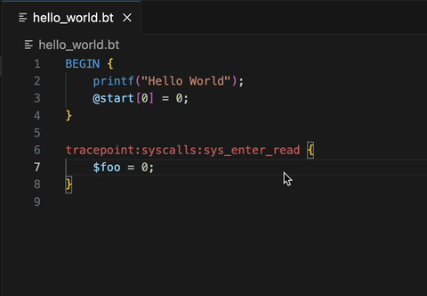

# Bpftracer

A slightly smarter bpftrace extension, featuring diagnostics and completions as well as syntax highlighting.

* ERRORS will be highlighted in red.
* Type a colon to autocomplete attach points.
* Type a $ or @ to autocomplete variables.



### Installation

This extension works by running `bpftrace` on your file to get diagnostics and `bpftrace -l` to list valid probes. You will need to setup passwordless sudo for bpftrace for this to work, because bpftrace only runs as root unfortunately. Here is a one-liner to perform the setup:
```
echo "$(whoami) ALL=(ALL) NOPASSWD: /usr/bin/bpftrace" | sudo tee /etc/sudoers.d/bpftrace-nopass
```
